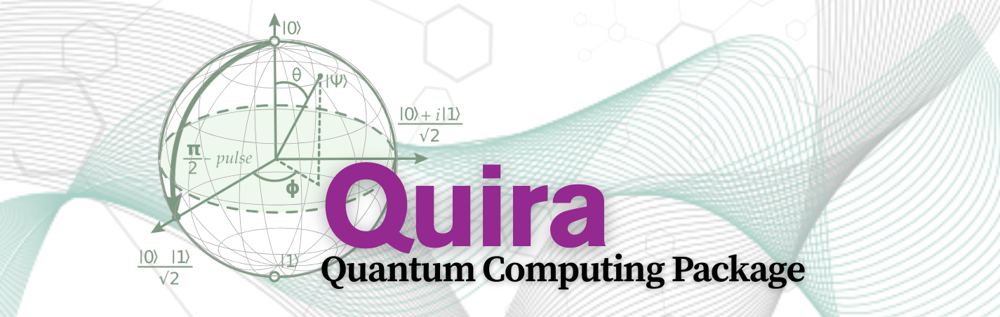

# Quira

## About Quira

Quira is a quantum computing package that transcends conventional bit-based computation. Its architecture is predicated on the mathematical formalism of quantum mechanics, where in computational states exist as complex probability amplitudes within a multidimensional Hilbert space. The framework harnesses the intrinsic parallelism of quantum superposition, enabling the simultaneous exploration of exponentially many computational paths through precisely orchestrated unitary transformations.

## References

1. S. S. Scott Aaronson, Quantum Computing for Everyone, MIT Press, 2019.
A gentle introduction to quantum computing, focusing on demystifying the subject for readers from a classical computing background.

2. Robert S. Sutor, Dancing with Qubits: How quantum computing works and how it can change the world, Packt Publishing, 2019.
A practical exploration of quantum computation principles, with real-world implications and intuitive visuals.

3. Michael A. Nielsen & Isaac L. Chuang, Quantum Computation and Quantum Information, Cambridge University Press, 10th Anniversary Edition, 2010.
The definitive graduate-level text on the theory of quantum computing and quantum information, covering the mathematical and algorithmic foundations in depth.
