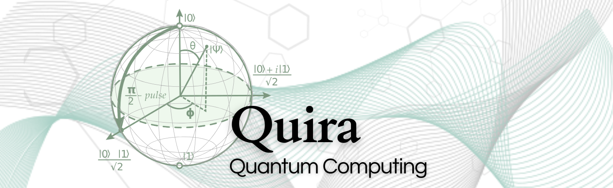

# Quira

Version: `0.1.0`

## About

Quira is a lightweight C++ quantum computing library for building and simulating
quantum circuits to explore quantum information.

The project is designed to keep the core API small, portable, and easy to embed
inside larger applications while still feeling familiar to users of modern
quantum computing libraries.

## Contributing

See [CONTRIBUTING.md](CONTRIBUTING.md).

## Code of Conduct

See [CODE_OF_CONDUCT.md](CODE_OF_CONDUCT.md).

## Changelog

See [CHANGELOG.md](CHANGELOG.md).

## License

Quira is licensed under the Apache License 2.0. See [LICENSE](LICENSE).
